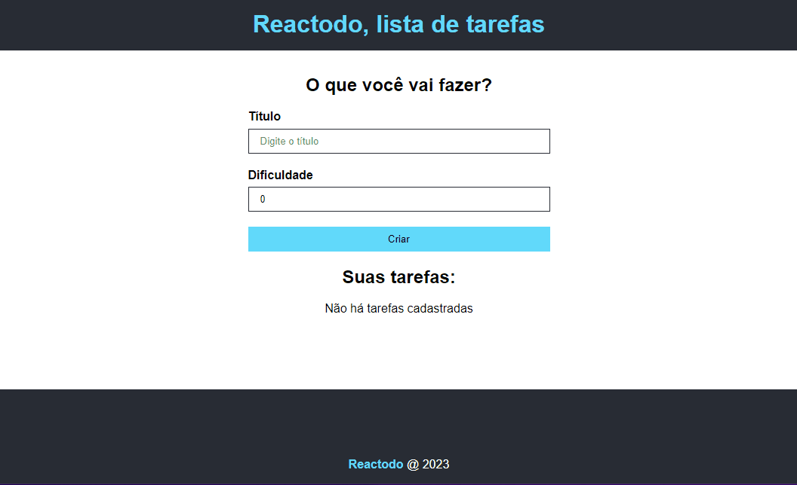

<h1 align="center"> Reactodo </h1>

  <a href="#tecnologias-">Tecnologias</a>&nbsp;&nbsp;&nbsp;|&nbsp;&nbsp;&nbsp;
  <a href="#sobre-">Sobre</a>

 
  Uma lista de tarefas feita em React e Typescript

  

## Tecnologias 👨‍💻 
Esse projeto foi desenvolvido com as seguintes tecnologias:
- React
- CSS(module)
- Typescript

## Sobre 📖

### Descrição
To-Do List feito em React e Typescript capaz de criar, editar e apagar várias tarefas.

### Objetivo
Praticar principais funções relacionadas a Typescript, como a criação de interfaces e props

by [William Bierhals](https://github.com/will1Zera)